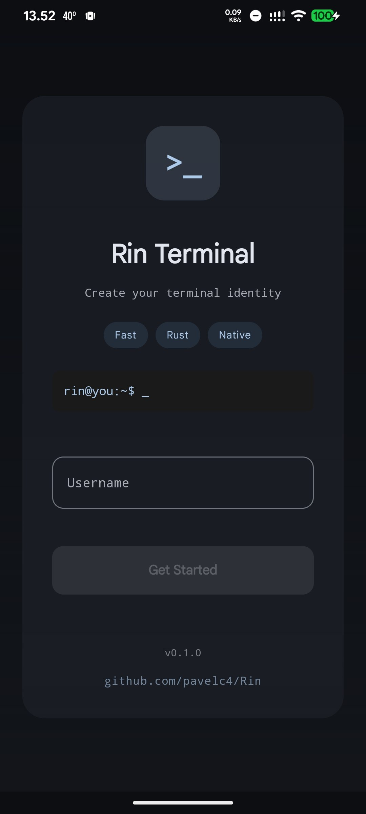
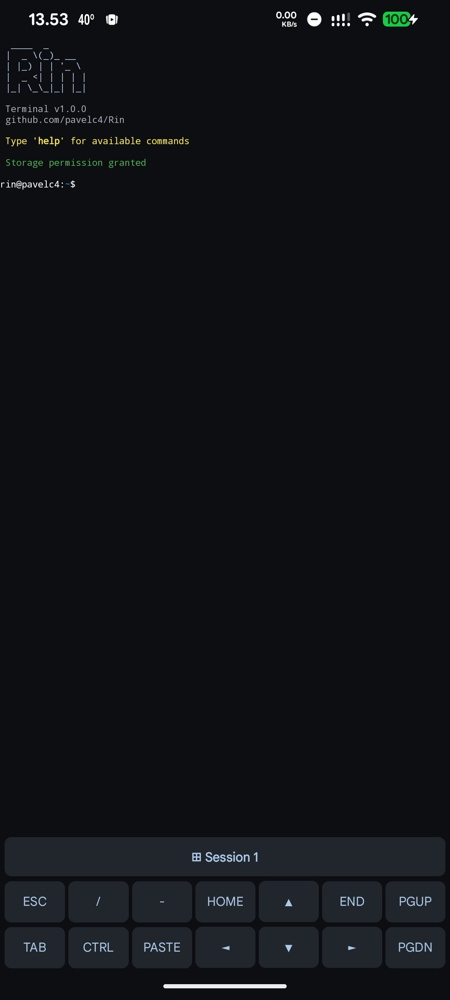
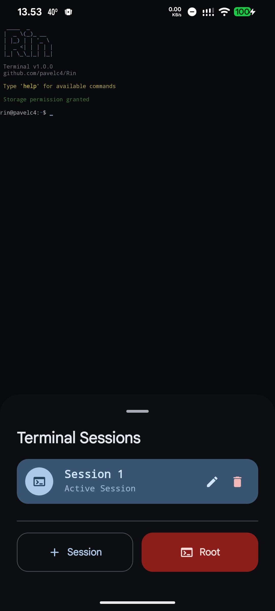
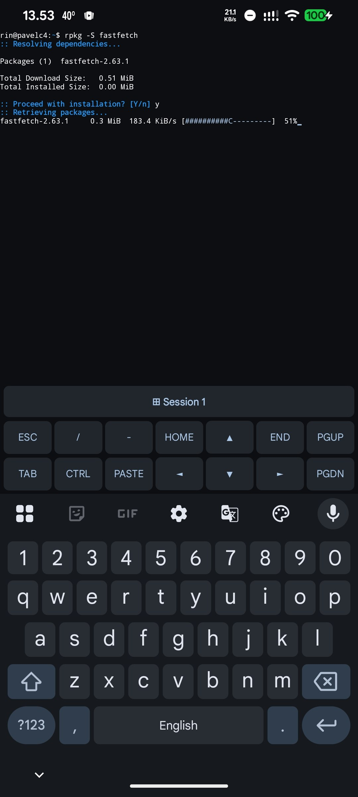
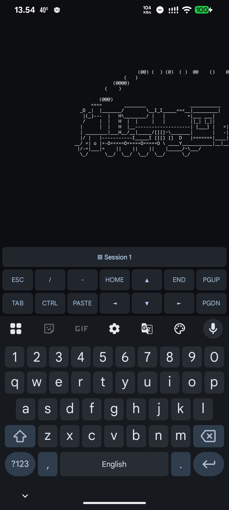
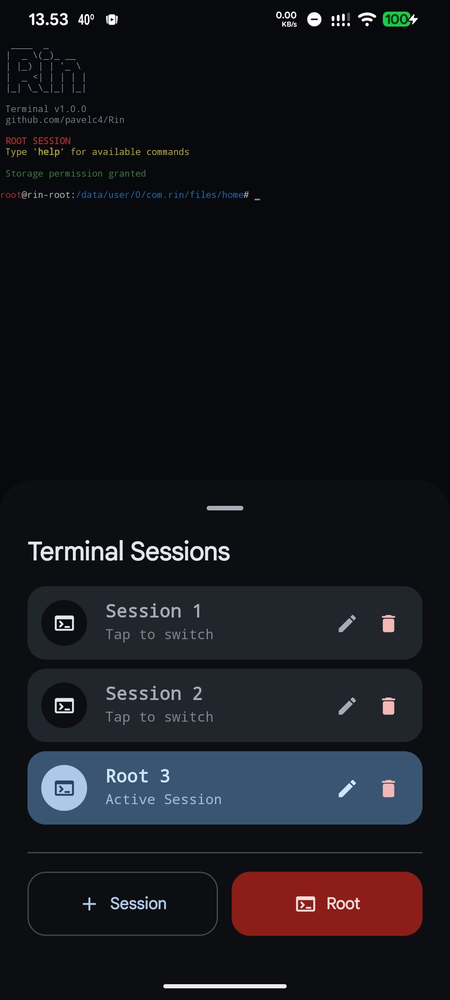

<h1 align="center">
    Rin Terminal
</h1>

<p align="center">
    
    
    
    
</p>

---

## About

Rin Terminal is an Android terminal emulator with a built-in package manager based on the Termux ecosystem.  
It is built using Kotlin, Jetpack Compose, and Rust through JNI.

---

## Screenshots

<p align="center">
    
    
    
</p>

<p align="center">
    
    
    
</p>

---

## Features

- **Built-in Package Manager (`rpkg`)**  
  Package manager, compatible with the Termux repository ecosystem.  
  → [Full documentation](doc/package-manager.md)

- **Material 3 UI**  
  Interface built with Jetpack Compose.

---

## Development Setup

### Prerequisites

- Android Studio (latest version)
- Android SDK (API 31+)
- Rust toolchain with `cargo-ndk` installed
- NDK 28.2.13676358 (or compatible version)

### Local Development

1. Clone the repository:

    ```bash
    git clone https://github.com/pavelc4/Rin
    cd Rin
    ```

2. Install `cargo-ndk` (required for building Rust libraries for Android):

    ```bash
    cargo install cargo-ndk
    ```

3. Set up Android NDK environment variable:

    **Linux/macOS:**
    ```bash
    export ANDROID_NDK_HOME=/path/to/your/android/sdk/ndk/28.2.13676358
    ```

    **Windows:**
    ```cmd
    set ANDROID_NDK_HOME=C:\Users\YourName\AppData\Local\Android\Sdk\ndk\28.2.13676358
    ```

4. Build the Rust JNI binary and compile the APK:

    **Linux/macOS:**
    ```bash
    ./build_android.sh
    cd android
    ./gradlew assembleDebug
    ```

    **Windows:**
    ```cmd
    build_android.bat
    cd android
    gradlew.bat assembleDebug
    ```

### Security Notice

- `local.properties` and `gradle.properties` are gitignored for security
- Keystore files are never committed to the repository
- All builds are reproducible and verifiable

---

## Requirements

- **Android Version** – Android 10 (API 29) or above
- **Architecture** – ARM64 (`aarch64`)

---

## Credits

- [Termux](https://termux.dev/) –  Android terminal emulator and Linux environment. `rpkg` leverages their incredible package repository ecosystem.

---

## License

Rin is open-sourced software licensed under the **MIT License**.  
See the [LICENSE](LICENSE) file for more information.
